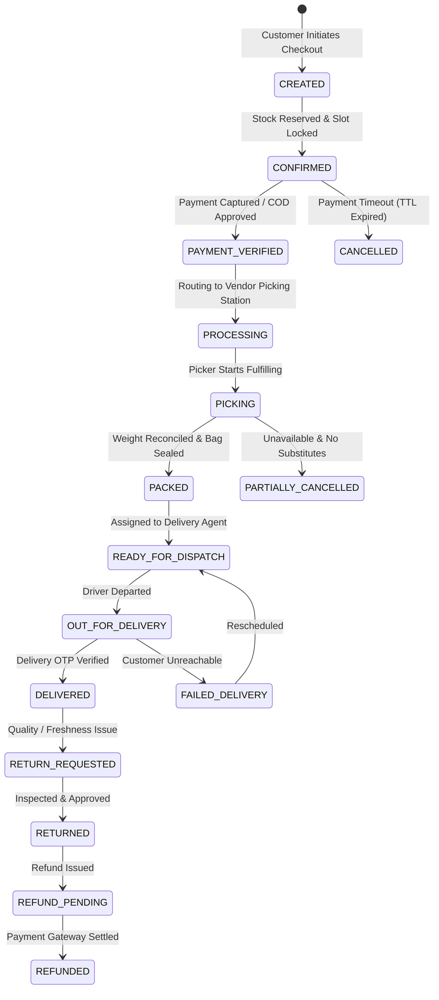

# Order Lifecycle State Machine & Transition Rules

FreshCart models grocery order fulfillment through an 11-stage finite state machine designed for multi-vendor grocery operations, cold-chain handling, picking tolerances, and variable-weight adjustments.

## State Transition Diagram

## State Machine Definitions & Actions

| State | Allowed Transitions | Triggered Actions |
|---|---|---|
| `CREATED` | `CONFIRMED`, `CANCELLED` | Creates draft order, reserves inventory in Redis/DB with 10-min TTL. |
| `CONFIRMED` | `PAYMENT_VERIFIED`, `CANCELLED` | Confirms delivery slot capacity reservation. |
| `PAYMENT_VERIFIED` | `PROCESSING`, `CANCELLED` | Captures authorization token, dispatches OrderPlaced notification. |
| `PROCESSING` | `PICKING`, `CANCELLED` | Generates picking slips per vendor store/dark store. |
| `PICKING` | `PACKED`, `PARTIALLY_CANCELLED` | Picker scans barcodes, weighs variable items, checks substitutions. |
| `PACKED` | `READY_FOR_DISPATCH` | Final invoice adjusted based on picked weights, bags labeled with QR. |
| `READY_FOR_DISPATCH` | `OUT_FOR_DELIVERY` | Driver assigned, delivery batch optimized. |
| `OUT_FOR_DELIVERY` | `DELIVERED`, `FAILED_DELIVERY` | SMS/Push with live tracking link and 4-digit Delivery OTP sent to customer. |
| `DELIVERED` | `RETURN_REQUESTED` | Delivery OTP entered by driver, order finalized, triggers review prompt. |
| `CANCELLED` | None | Releases inventory reservations, releases delivery slot, voids payment auth. |
| `REFUNDED` | None | Credit returned to original payment source or wallet. |
