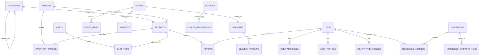

# FreshCart Database Schema & Relational Design

The database schema is organized across 18 modular domains with foreign key constraints, indexes, and soft-deletion tracking.

## Core ER Model

## Schema Entities Summary

1. **Identity & Auth**: `users`, `user_profiles`, `user_addresses`, `dietary_preferences`, `user_sessions`, `refresh_tokens`, `otp_records`, `login_history`.
2. **Households**: `households`, `household_members`, `household_shopping_items`.
3. **Catalog**: `categories`, `products`, `product_variants`, `product_images`.
4. **Inventory**: `vendors`, `inventory_batches`, `inventory_transactions`, `stock_reservations`.
5. **Commerce**: `carts`, `cart_items`, `wishlists`, `wishlist_items`, `coupons`, `coupon_redemptions`.
6. **Orders & Logistics**: `orders`, `order_items`, `order_status_history`, `order_fulfillments`, `payments`, `payment_refunds`, `delivery_zones`, `delivery_slots`, `shipments`.
7. **Intelligence & BI**: `smart_grocery_plans`, `replenishment_schedules`, `substitution_logs`, `reviews`, `notification_logs`, `admin_audit_logs`.
